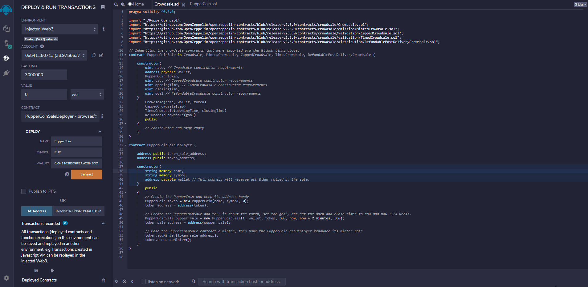

## Project Overview

The goal of this project was to deploy a crowdsale, which offered PupperCoin tokens (PUP) in exchange for ether (ETH).  To complete this project the following OpenZeppelin libraries were utilized: ERC20, ERC20Detailed, ERC20Mintable, Crowdsale, MintedCrowdsale, CappedCrowdsale, TimedCrowdsale, and RefundablePostDeliveryCrowdsale.  All libraries were used together to deploy the crowdsale and define parameters of the sale.  A total of three contracts were built to accomplish all tasks.  The PupperCoin contract was used to generate tokens, the PupperCoinSale contract defines the parameters of the crowdsale, and the PupperCoinSaleDeployer contract brings all contracts together and deploys the sale.  Further details of the process, along with examples, can be found in the content below. 

### PupperCoin Contract

The PupperCoin contract can be found in the PupperCoin.sol file.  This contract was created simply to generate a token that meets ERC20 standards.  The contract inherits the ERC20, ERC20Detailed, and ERC20Mintable contracts that were imported from Github at the top of the file.  It was built using the ERC20Detailed constructor, which accepts the following arguments: name, symbol, and decimals.  A decimal amount of 18 was hardcoded in to align with Ethereum use cases (1 ETH = 10^18 wei).  This contract is later imported into the Crowdsale.sol file, allowing it to be inherited into the PupperCoinSale and PupperCoinSaleDeployer contracts as needed.  

### PupperCoinSale Contract 

The PupperCoinSale contract can be found in the Crowdsale.sol file.  This contract inherits the Crowdsale, MintedCrowdsale, CappedCrowdsale, TimedCrowdsale, and RefundablePostDeliveryCrowdsale contracts that were imported from Github at the top of the file. All variables defined in the constructor align with varialbes required to be passed into each inherited crowdsale contract's constructor.  No variables were hardcoded in this contract, allowing for contract reuse and flexibility.  

### PupperCoinSaleDeployer Contract

The PupperCoinSaleDeployer contract can also be found in Crowdsale.sol file.  This contract was built to bring all contracts together and actually deploy the crowdsale.  Once deployed, this contract will provide the address of the token generated from the PupperCoin contract, as well as the token sale address generated from the PupperCoinSale contract.  Within the constructor variables are passed to define the token and sale.  The name of the token will be provided here ("PupperCoin"), the symbol will be provided ("PUP"), and the wallet address that will be collecting all Ether raised from the sale.  A demonstration of how this works is provided "Interacting with the Contract" section below.  

Within the constructor of this contract the token_address and token_sale_address variables are defined.  The token_address variable references the PupperCoin contract and generates an address to this token.  The token_sale_address variable references the PupperCoinSale contract and generates an address to the sale.  When defining the sale the following paremters are set: 
  - Rate of 1, which means 1 token = 1 ETH 
  - Cap of 300 (ETH)
  - Start time of now.
  - End time of now + 24 weeks
  - Goal of 300 (ETH), which matches the cap defined. 
  
Finally, the PupperCoinSale contract is added as the minter and the PupperCoinSaleDeployer contract has its minting abilities renounced.  

### Interacting with the Contracts

The contract was tested on my local network, and later deployed to the Ropsten test network.  The examples below show the contract operating on my local network.  In an effort to test all functionality, a cap and goal of 300 was set and the end time of the sale was 2 minutes after launching. 

The gif below outlines the deployment of the PupperCoinSaleDeployer contract.  As can be viewed in the gif, once the contract is deployed it can be interacted with to view the token address and token sale address.  As mentioned previously, this is due to the inheritance of the PupperCoin and PupperCoinSale contracts.  

The gif below outlines how to participate in the crowdsale by purchasing tokens.  As can be viewed in the gif, the amount of tokens to be purchased can first be entered in the "Value" box.  From there an address needs to be entered within the contract interaction, which is the address that will be acquiring the tokens.  NOTE: This address needs to be different than the address that was used to deploy the contract.  The address that deployed the contract will be collecting all Ether at the end of the sale.  

As can also be viewed from the gif, the contract can be interacted with once the tokens are purchased.  You can view the crowdsale goal, cap, if the goal has been reached, if the sale is still open, if the sale is finalized, etc. by clicking on the corresponding buttons.  Once the sale is finalized and closed the responses provided by these interatction will change accordingly.  This will be demonstrated next.  

The gif below outlines the changes in contract interaction once the sale has been finalized and closed.  As mentioned previously, the end time of this contract was set for 2 minutes after deployment.  This was done for testing and example purposes.  As can be seen below, the crowdsale was first finalized.  This was done after the required 2 minutes had passed.  Once finalized, the "finalized" interaction then evaluates to true, the "isOpen" interaction now evaluates to false, and the "hasClosed" interaction now evaluates to true.  It can also be viewed that the goal and cap of 300 (ETH) has been met.  

### Adding Tokens to MyCrypto & MetaMask 

Following contract interactions on my local machine, everything was then deployed to the Ropsten test network.  Once this was done the token created from the contract was added to MetaMask and MyCrypto.  Examples of both can be found below. 

Adding the token to MetaMask is as simple as opening your MetaMask extension, clicking on "Add Token", selecting "Custom Token", and entering the token address.  The token address to enter can be found in Remix - the PupperCoinSaleDeployer contract allows you to view the token address.  

Adding the token to MyCrypto is similarly as easy.  Once in your MyCrypto account, click on "Add Custom Token" under the "Token Balances" section, enter the address of your token, and click "Save".  Once the token is added you will see it populate on your MyCrypto, as shown below. 

Finally, the below screen shots outline an actual transaction on the Ropsten test network.  Due to limited ETH available on the test network, a transaction of 10 wei was made.  This is reflected in the transaction screen shots below, but also means the token value will continue to show 0 due to such a small amount of wei being transacted.  

The screenshot below shows transaction hash details from MyCrypto. 

The screenshot below shows the transaction on Etherscan, which reflects the value of 10 wei transacted.  

